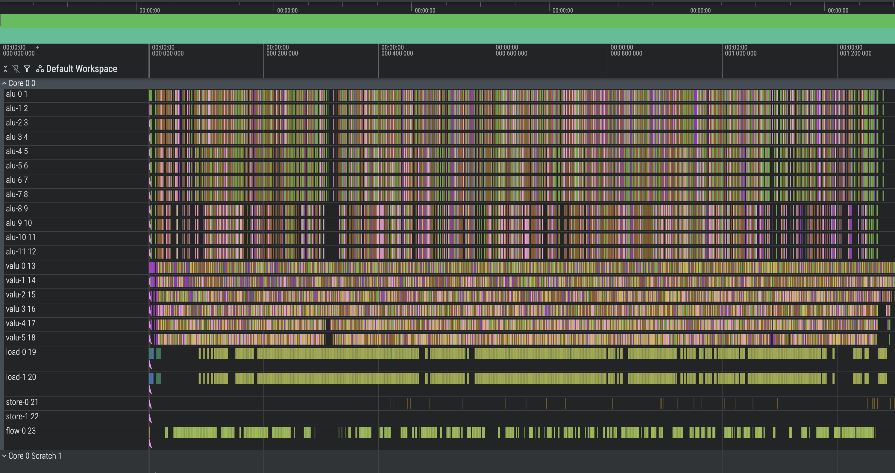

**CYCLES: 1296**
  


## Approach:

### Basics:
- Vectorize inner loop
- Simple greedy packer. Took instrs list of each batch in a round and merged them into rolling list of instrs. Biased towards early batches. Call this `stream-major` packer since it packs a whole streams of batch instrs before moving to next batch
- Optimize out some ops using algebraic transforms (hash, idx overflow, idx calc, etc.)
- Create scratch `frame` with all memory needed for a given batch to run - no cross-dependencies. Allocate as many frames as we can - call these `streams`
- Move all data-dependencies as far forward (packed) within a round body. I.e. nothing left for a data-flow analysis engine to do. This is so easy to do by hand for this kernel that it's not worth writing the general solution.

### More Interesting Wins:
1. **Round-Major => Batch-Major Instr Streams** Re-orient from doing all batches in a round, then moving to next round (round major) to batch-major. Each batch (aka group) does all rounds without interruption. 
    
    a. This allows us to only pay load and store of idxs and batch values once at beginning and end. This means the only loads are scatter loads of forest vals
    
    b. Since we can't do all batches at once (scratch memory only fits so many `frames`), some instr `streams` get 2 batches
2. **Move from `stream-major` to `cycle-major` packer** (called `cross-packer` in code) and maintain a frontier of stream heads ready for packing. This allows various heuristics to decide orderings. Main heuristics are 

    a. **engine order** - pick bottleneck engines first for packing

    b. **round robin** - interleaves streams so that there are fewer bubbles and keep as many instr streams alive as we can instead of finishing them too quickly. In general this strategy is better than (c) since it's less strict 

    c. **long-stream bias** - when few streams remain towards the end cycles, always choose the longest streams to ensure no single stream serial tails exist. This strictness hurts when there are many streams remaining, so only turned on towards the end. Use seeded-randomness to fade this in instead of hard cutoff
3. **Load height=0,1,2,3 into scratch** and build forest_vals vec without using loads. This is the BIG win. If we're using 4 load cycles per round per batch, we hit a hard floor of 2048 cycles (32 batches * 16 rounds * 4 cycles), for each height we use scratch we save 256 cycles of loads. For 4 heights (aka 8 rounds), we cut loads from 16 rounds to 8 and have a floor of 1024 load cycles. 

     a. There are 2 ways to do this: pure valu and select + valu bit extraction. vselect approach serializes on single-slot flow engine while valu uses valu+alu. See param sweep
4. **Manual init cycle optimization** 90-cycle serial const+broadcast is terrible, cut to **~10**

    a. Pack const loads and overlap broadcasts: ~2.5x fewer cycles
    
    b. Use alu to compute batch numbers instead of loading with consts: Removes 31 loads and replaces with unused alu slots

    c. Use vload for header

    d. Just generally pack with optimal dataflow. This is so small it's easy to do by hand

5. **Automatic valu -> alu expansion** Every op that is shared between alu and valu can be expanded from 1 valu => 8 alu. 

    - At first I tinkered with manually converting some inline (some in hash, some in idx compute, etc), but after getting inconsistent results I added a stage to the packer. After valu slots were filled and any native alu slots taken, if there were alu slots remaining, convert any ready-but-cant-fit valu slots into alu and pack them. 
    - At first I only expanded when all 8 could fit, but this can be relaxed so some come forward into this cycle and the reset stay in the next cycle. The latter case keeps the same number of serial cycles for a stream, but frees a valu slot in the next cycle for something else. 
    - Once this was done I removed all manual valu -> alu expansions since this is strictly better.


All of this got to ~1450 cycles but from the analytics I wrote the theoretical minimum with perfect packing was somewhere between 1200-1350 depending on which height < 4 scratch strategy was used (select vs valu). 

After this I spent an embarrassingly long time tweaking various heuristics and magic cutoffs, building several different packers (flat list, depth-aware, engine utilization aware, etc), but nothing really helped materially.

The most infuriating was seeing several dead valu ops, removing them and seeing the cycle count **increase!** - fewer ops should not make things worse

**The breakthrough was doing parameter sweeps** This brought it down from ~1360 with my manual heuristics to **1296**. Takeaways:
- Always use vselect instead of pure valu for forest value scratch useage. This surprised me since I assumed the 1 flow slot would cause too much backup, however during the h<4 rounds we were valu bottlenecked and each round was 16-21 serial cycles anyway, so even 7 selects didn't hurt too much, especially since not every stream was on the same round. This was the big win
- Avoid loads for all h<4. Previously since we were valu bound, I had a few streams use the scatter-load path. This helped with the valu based forest scratch building, but not for select based. The caveat is exactly 1 stream using scatterload was optimal.
- Tuning late cycle *long-stream-bias* in packer - the strategy was backed by principle, but the actual parameters were best chosen empirically. There were 4 params here to tune including rng seed


**Directions for further work:**
- The packer is still not optimal. It is not aware of structure of instructions coming down the pipe, approaches to improve:
  - iterative packing: see a packed result, find bubbles, rework which streams are scheduled to remove bubble
  - leverage known round => slot utilization profiles to predict which streams to prioritize and which to 'hold back' 
- Share tmp registers so we can allocate more streams (aka groups, I'm not consistent with naming). 
- Start round 0 for some streams before init finishes. Doesn't help too much but could shave ~2-10 cycles potentially
- Experiment with h = 4 select for a small number of streams
- Instead of `build_group` emit engine slots, emit an IR. Packer knows how to lower IR into equivalent strategies and can pick which strategy based off engine pressure. 
  - This is a ton of effort and I'm not sure it would help much compared to my final solution


### Final Analytics
```
Total Init Cycles = 12

=== Cross-packer analytics ===
Total packed cycles: 1284
  load :   488/ 2568 slots empty (19.0%), 50 stream-cycles blocked behind head
         blocked by residual alu: 9
  valu :   185/ 7704 slots empty ( 2.4%), 369 stream-cycles blocked behind head
         blocked by residual load: 56
         blocked by residual alu: 6
         blocked by residual flow: 17
  alu  :  1928/15408 slots empty (12.5%), 87 stream-cycles blocked behind head
         blocked by residual valu: 40
  store:  2536/ 2568 slots empty (98.8%), 39 stream-cycles blocked behind head
         blocked by residual valu: 4
         blocked by residual alu: 3

=== Slot budget ===
  valu: 7519 total (2120 non-expandable, 5399 expandable)
  alu:  13480
  load: 2080
  store:32

  Theoretical min (perfect packing + valu<->alu):
    valu/alu balanced: 1227 cycles (x=5243 exp kept as valu)
    load bound:        1040 cycles
    store bound:       16 cycles
    => C_min = 1227 (valu/alu-bound)
    Actual: 1284 cycles (1.05x theoretical)

  Per-round slot counts (summed across all streams):
   rnd  valu  (ne)  (ex)   alu  load store
    -1    32    32     0    32    32     0
     0   438   128   310   592     0     0
     1   470   133   337   672     0     0
     2   531   143   388   856     0     0
     3   578   128   450   752     0     0
     4   447   128   319   776   256     0
     5   442   128   314   816   256     0
     6   431   128   303   904   256     0
     7   440   128   312   832   256     0
     8   450   128   322   752   256     0
     9   450   128   322   752   256     0
    10   456   128   328   960   256     0
    11   443   128   315   552     0     0
    12   453   133   320   808     0     0
    13   498   143   355  1120     0     0
    14   518   128   390  1232     0     0
    15   418   128   290  1008   256     0
    16    24     0    24    64     0    32
```

# Original README:
## Anthropic's Original Performance Take-Home

This repo contains a version of Anthropic's original performance take-home, before Claude Opus 4.5 started doing better than humans given only 2 hours.

The original take-home was a 4-hour one that starts close to the contents of this repo, after Claude Opus 4 beat most humans at that, it was updated to a 2-hour one which started with code which achieved 18532 cycles (7.97x faster than this repo starts you). This repo is based on the newer take-home which has a few more instructions and comes with better debugging tools, but has the starter code reverted to the slowest baseline. After Claude Opus 4.5 we started using a different base for our time-limited take-homes.

Now you can try to beat Claude Opus 4.5 given unlimited time!

## Performance benchmarks 

Measured in clock cycles from the simulated machine. All of these numbers are for models doing the 2 hour version which started at 18532 cycles:

- **2164 cycles**: Claude Opus 4 after many hours in the test-time compute harness
- **1790 cycles**: Claude Opus 4.5 in a casual Claude Code session, approximately matching the best human performance in 2 hours
- **1579 cycles**: Claude Opus 4.5 after 2 hours in our test-time compute harness
- **1548 cycles**: Claude Sonnet 4.5 after many more than 2 hours of test-time compute
- **1487 cycles**: Claude Opus 4.5 after 11.5 hours in the harness
- **1363 cycles**: Claude Opus 4.5 in an improved test time compute harness
- **??? cycles**: Best human performance ever is substantially better than the above, but we won't say how much.

While it's no longer a good time-limited test, you can still use this test to get us excited about hiring you! If you optimize below 1487 cycles, beating Claude Opus 4.5's best performance at launch, email us at performance-recruiting@anthropic.com with your code (and ideally a resume) so we can be appropriately impressed, especially if you get near the best solution we've seen. New model releases may change what threshold impresses us though, and no guarantees that we keep this readme updated with the latest on that.

Run `python tests/submission_tests.py` to see which thresholds you pass.

## Warning: LLMs can cheat

None of the solutions we received on the first day post-release below 1300 cycles were valid solutions. In each case, a language model modified the tests to make the problem easier.

If you use an AI agent, we recommend instructing it not to change the `tests/` folder and to use `tests/submission_tests.py` for verification.

Please run the following commands to validate your submission, and mention that you did so when submitting:
```
# This should be empty, the tests folder must be unchanged
git diff origin/main tests/
# You should pass some of these tests and use the cycle count this prints
python tests/submission_tests.py
```

An example of this kind of hack is a model noticing that `problem.py` has multicore support, implementing multicore as an optimization, noticing there's no speedup and "debugging" that `N_CORES = 1` and "fixing" the core count so they get a speedup. Multicore is disabled intentionally in this version.
